# Basic-number-captcha-solver with tensorflow CNN

This is a real-life implementation of [CNN](https://www.tensorflow.org/tutorials/images/cnn?hl=tr) on Python 3, Keras, and TensorFlow. We work in 2 main steps using [`Preprocess.py`](Preprocess.py) which creates artifactless digit images which are later on fed to CNN model in [`train.py`](train.py) which trains and saves the CNN model.

This captcha solver was developed to be used in and currently being used in [metu-NTE-scraper](https://github.com/e-hengirmen/metu-NTE-scraper) to get around METU's student portal captcha protection for course capacity checks https://student.metu.edu.tr/. But u can use it in your application with simple steps which are explained in [How to use it?](#how-to-use-it) section.

# CNN Model Description
I trained a CNN using TensorFlow to classify images of captcha digits after digit extraction. The model consists of 2 convolutional layers and pooling layers followed by a fully connected layer. I trained the model on a dataset of 10000 captcha images which was later on divided into 60000 digit images and achieved a test accuracy of 99.94% on a 12000 digit img test set.

Train and test accuracy of the model are:  
* Train accuracy: 1.0
* Test  accuracy: 0.9994166493415833

Note: Some of the images of activation neuron responses can be seen below the 4 Preprocess steps

# How to use it?
1. Import [`predict.py`](predict.py) to your python program:
```
Import predict
```
2. And call `predict_captcha` function using the captcha image's filepath as the only argument to predict the captcha
```
filepath="path\to\captcha\image"
prediction=predict.predict_captcha(filepath)
```

# How does it work

To help with understanding the digit extractor and the model we show the visualized their steps for you

The [`Preprocess.py`](Preprocess.py) works in 4 steps to create digit images which are shown below with the model activations at the end

## 1-Artifact removel
In first step we clear the artifacts of the captcha images which was collected using [`SampleCollecter.py`](SampleCollecter.py)

Original Image            |  After artifact removel
:-------------------------:|:-------------------------:
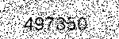  |  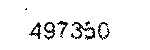
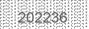  |  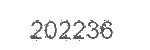

## 2-Clipping
Later on the artifactless image is clipped to bound the digits of the captcha

After artifact removel            |  Clipped
:-------------------------:|:-------------------------:
  |  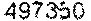
  |  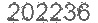

## 3-K_means
Than weighted K-means is used to find the centers of the each digit

Clipped            |  Centroids
:-------------------------:|:-------------------------:
  |  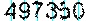
  |  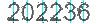

## 4-Digit Extraction
Lastly we create digit images using the centroids found from k-means

Centroids            |  Digits
:-------------------------:|:-------------------------:
  |  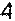 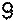 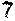 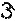 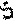 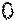
  |  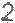 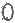 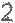 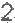 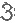 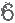

## 5-Activation Images
After the digits are extracted. The CNN model is used to predict the captcha images. Here are generated activation neurons for the last convolutional layer of the CNN. These images were created by extracting the output of the last convolutional layer and visualizing it as an image. Below activation images show the response of some of the filters in the last convolutional layer of 2 digit images.

Extracted Digit            |  activation 10 |  activation 18 |  activation 26 |  activation 29
:-------------------------:|:-------------------------:|:-------------------------:|:-------------------------:|:-------------------------:
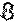 | 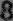 | 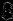| 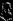| 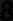
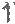  | 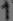| 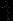| 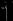| 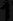

Note: To see the other neuron responses u can check [activations](visualized_steps/5-activations/)


